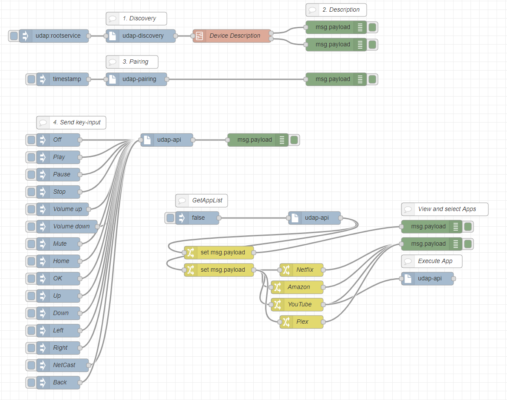

# node-red-contrib-lg-udap
Node-RED node for UDAP/2.0 supported by NetCast 3.0 Devices like LG Smart TV models 2012/13

Specifications can be found here: [NetCast-UDAP.pdf](http://webostv.developer.lge.com/application/files/1214/7919/6747/NetCast_-_UDAP.pdf)
(See: Annex A for table of key codes)

Also see Example Flow: 
